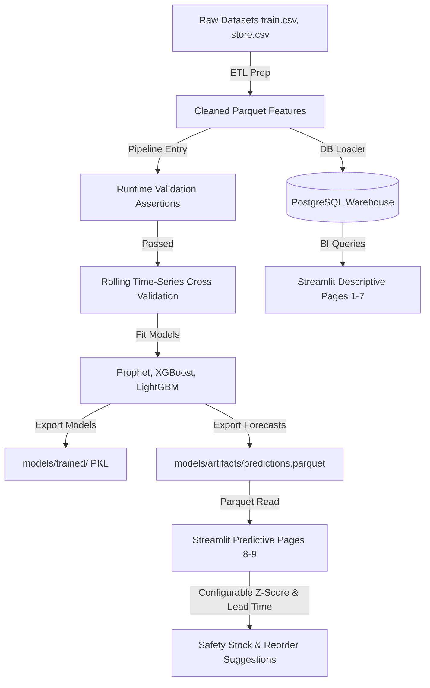

# Retail Demand Forecasting & Inventory Optimization Platform

An end-to-end enterprise analytics and machine learning solution built following the **CRISP-DM** methodology. The platform forecasts store-level daily sales demand across 1,115+ drugstore locations and translates those forecasts into actionable inventory safety stocks, reorder recommendations, and stockout risk indicators.

---

## 1. Business Statement (Problem Statement)
Traditional retail inventory management struggles with balancing **holding costs** against **stockout penalties**. In drugstore networks:
- Sales patterns exhibit high seasonality, promotional response, weekly patterns (Sunday closures), and regional public holiday impacts.
- Manual ordering methods fail to capture non-linear relationships across 1,115+ stores, leading to either capital tied up in overstock or lost revenue from stockouts.
- Store managers lack access to interactive dashboards showing side-by-side comparative model forecasts and safety stock recommendations.

---

## 2. Proposed Solution
This platform implements a data-to-decision pipeline containing:
1. **Relational Data Warehouse**: An OLAP database layer in PostgreSQL storing descriptive store metrics and sales records.
2. **Machine Learning Forecasting Engine**: An ensemble modeling system using per-store **Prophet** models (capturing calendar effects and weekly patterns) alongside global **XGBoost** and **LightGBM** models (learning complex cross-store interactions).
3. **Inventory Planning Dashboard**: An interactive Streamlit dashboard mapping model forecasts directly to reorder metrics (safety stock, reorder point, stockout risks) using lead time and target service levels.

---

## 3. Project Objectives & Deliverables
- **Data Ingestion & Warehousing**: Merging, cleaning, and loading 1.02M sales records into PostgreSQL.
- **Robust Feature Engineering**: Extracting lag characteristics, rolling metrics, and time-based cyclical features.
- **Accurate Forecasting**: Training models evaluating 3-fold rolling cross-validation with an $R^2 > 0.90$.
- **Early Data Validation**: Asserting schema integrity, null checks, and value boundaries at runtime to prevent training corruptions.
- **Actionable Decision Interface**: Visualizing reorder recommendations, safety stock margins, and interactive performance comparisons.
- **Production-grade Containerization**: Packaging the workspace using Docker and Docker Compose.

---

## 4. Data Understanding
The platform models sales demand using the Kaggle **Rossmann Store Sales** dataset, consisting of daily records from 1,115 drugstores over 2.5 years (~1.02M rows).

### Primary Datasets:
*   **`train.csv`**: Contains daily sales transactions, customer volume, promotion flags, state/school holidays, and store open status.
*   **`store.csv`**: Store-level attributes including store type (a, b, c, d), assortment type (a, b, c), competitor distance, competitor open month/year, and active multi-stage promotion intervals (Promo2).
*   **`test.csv`**: A held-out 48-day test period (from 2015-08-01 to 2015-09-17) used to forecast future demand and test inventory plan efficacy.

### Key Exploratory Data Analysis (EDA) Insights:
1.  **Weekly Seasonality**: A clear sales drop occurs on Sundays due to regional store closure regulations (most stores show 0 sales and customers on Sundays).
2.  **Promotion Impact**: Active promotions (Promo = 1) lift daily sales by an average of 40% per store.
3.  **Competition Influence**: Stores with closer competitors experience a lower baseline sales level, but promotional responsiveness remains highly pronounced.
4.  **Holidays**: Public holidays (StateHoliday = 'a', 'b', 'c') cause significant temporary spikes on preceding open days followed by complete closures.

---

## 5. Tech Stack Used & Functionality

| Technology | Functionality |
| :--- | :--- |
| **Python 3.11** | Core programming language for processing pipelines and model development. |
| **Pandas / NumPy / SciPy** | Data wrangling, array manipulation, and statistical distribution modeling. |
| **PostgreSQL 16** | Relational OLAP data warehouse. |
| **SQLAlchemy / pg8000** | Python database connector and object-relational mapping (ORM) layer. |
| **Prophet** | Local per-store additive regression time-series forecasting. |
| **XGBoost / LightGBM** | Global gradient boosted decision tree regressors with native categorical features support. |
| **Plotly Express / GO** | Interactive, dynamic dashboard charts. |
| **Streamlit** | Multi-page frontend interface for dashboard users. |
| **Docker / Docker Compose** | Containerization of PostgreSQL database and Streamlit application services. |
| **PyTest** | Automated unit testing framework. |
| **PyYAML** | Decoding external configuration scripts (`config/config.yaml`). |

---

## 6. System Architecture



---

## 7. Project Structure

```
.
├── .claude/                    # Local IDE tool execution state (gitignored)
├── config/                     # Pipeline YAML configs
│   └── config.yaml             # Central configuration file
├── data/
│   ├── raw/                    # Immutable source CSV files
│   ├── interim/                # Cleaned intermediate tables
│   └── processed/              # Analysis-ready merged Parquet features
├── dashboard/                  # Multi-page Streamlit application
│   ├── app.py                  # Streamlit entry point
│   ├── pages/                  # Descriptive & predictive pages (1-9)
│   └── components/             # Reusable UI widgets & DB connectors
├── deployment/
│   └── docker/
│       └── Dockerfile          # Optimized Streamlit app docker image
├── docs/                       # CRISP-DM phase documents & plans
├── logs/                       # Running execution pipeline logs
├── models/
│   ├── trained/                # Serialized final model pickles
│   └── artifacts/              # predictions.parquet & validation metrics
├── notebooks/                  # Numbered phase development notebooks
├── sql/
│   ├── schemas/                # SQL DDL warehouse table creation scripts
│   └── queries/                # Analytical reports
├── src/
│   ├── feature_engineering/    # Feature creation scripts
│   ├── machine_learning/       # Model wrappers & CV pipeline script
│   └── utils/                  # Shared loggers & runtime validation
├── tests/
│   └── unit/                   # Automated unit test suite
├── .gitignore                  # Git excluded list
├── config.py                   # Central configuration parser
├── docker-compose.yml          # Local multi-container Docker config
├── main.py                     # Unified project command-line CLI
└── requirements.txt            # System dependencies list
```

---

## 8. Running the Project

### Using the CLI (`main.py`)
Run tasks directly from your terminal using Python:

```bash
# 1. Run all unit tests
python main.py --action test

# 2. Run data loading script into PostgreSQL database
python main.py --action load-db

# 3. Train models and generate forecasting predictions
python main.py --action train

# 4. Start the Streamlit dashboard server locally
python main.py --action run-dashboard
```

### Using Docker Compose
Ensure Docker Desktop is active on your host system. Spin up the entire database and Streamlit stack with a single command:

```bash
# Start containers in background mode and compile/build local images
docker compose up --build -d

# Stop and tear down all active containers and network volumes
docker compose down -v
```

---

## 9. Future Scope
1. **Automated MLOps Retraining Trigger**: Schedule pipeline executions automatically when validation metrics drift past performance thresholds.
2. **Deep Learning Forecasting**: Incorporate architectures like DeepAR or Temporal Fusion Transformers (TFT) for comparative analysis against trees.
3. **API Serving Layer**: Wrap final models inside a FastAPI service to provide external real-time demand forecast endpoints for other ERP systems.
